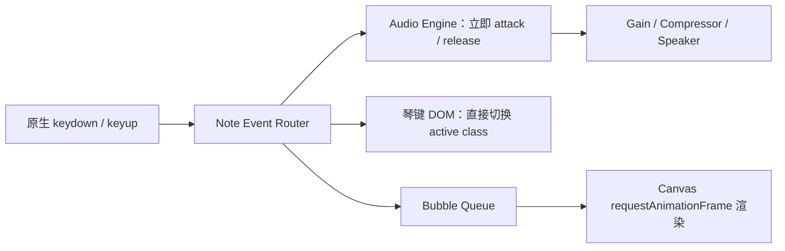

# 钢琴气泡模拟器 MVP 技术方案

版本：v0.1
日期：2026-07-18

## 1. 一句话定义

用户用电脑键盘弹奏两组八度的虚拟钢琴；每次按键立即发声、琴键点亮，并从对应琴键位置生成同音高配色的气泡。松键后琴声自然释放，气泡上浮并消散。

## 2. 可行性结论

可以做成“体感近乎无延迟”的网页版，但不能承诺物理意义上的 0 ms。键盘、浏览器音频缓冲、操作系统和扬声器都会产生累计延迟，尤其蓝牙耳机本身可能引入明显延迟。首版应以 Chrome / Edge 桌面端、电脑内置扬声器或有线耳机作为低延迟验收环境。

核心原则：声音优先。按键事件收到后立刻触发已解码的内存音频；琴键和气泡从同一个事件分流渲染，绝不等待网络、React 状态更新或动画完成后再发声。

## 3. MVP 范围

### 必做

- 24 个音：C4–B5，两组八度，支持和弦。
- `keydown` 发音，`keyup` 收音；长按不重复触发音头。
- 屏幕钢琴同步按下、抬起。
- 每个音有固定颜色；按下时从对应琴键中心冒出气泡。
- 气泡按住时轻微变大，松开后上浮、淡出。
- 空格键作为延音踏板。
- 音量、静音、气泡数量三个控制项。
- 首次进入显示“点击开始”，完成浏览器音频授权及音源预热。
- 页面失焦、切换标签页时自动释放全部琴键，避免卡音。
- 显示简易延迟诊断：`AudioContext.baseLatency`、浏览器、输出设备提示。

### 首版不做

- 不做账号、云端存储、排行榜和后端服务。
- 不做录音、谱面识别、教学评分。
- 不承诺蓝牙设备的低延迟体验。
- 不上 3D / Three.js；当前气泡效果用 Canvas 2D 已足够，成本和性能都更稳。

## 4. 推荐技术栈

| 层 | 推荐 | 理由 |
|---|---|---|
| 工程 | Vite + React + TypeScript | 启动快、生态成熟，配置面板容易扩展 |
| 音频 | Tone.js `Sampler` + Web Audio API | 可直接播放多音采样，支持 attack/release、复音与效果链 |
| 琴声 | Salamander Grand Piano V3，裁剪并自托管 | 真实钢琴采样，CC BY 3.0；必须在产品中保留署名 |
| 琴键 | 原生 DOM/CSS | 24 键规模无需重型组件，便于准确获得每个琴键的气泡发射坐标 |
| 气泡 | Canvas 2D + `requestAnimationFrame` | 与 React 渲染隔离，能稳定处理粒子动画 |
| 状态 | React 只管设置；热路径用普通对象、`Set` 和事件队列 | 避免每次弹奏触发整棵组件树重渲染 |
| 部署 | 静态站点/CDN | MVP 无后端；音源与前端同域缓存，减少网络不确定性 |

不建议把 WebAudioFont 作为商业项目默认内核：资源丰富，但 npm 包为 GPL-3.0-or-later，授权边界不如 Tone.js（MIT）清爽。`react-piano` 可参考键位和布局，但本项目需要琴键坐标驱动气泡，直接做轻量琴键层更合适。

## 5. 键盘映射

必须用 `KeyboardEvent.code`，按物理位置识别，避免中文输入法、大小写或不同键盘布局改变映射。

```text
高八度： Q  2  W  3  E  R  5  T  6  Y  7  U
音名：   C  C# D  D# E  F  F# G  G# A  A# B

低八度： Z  S  X  D  C  V  G  B  H  N  J  M
音名：   C  C# D  D# E  F  F# G  G# A  A# B

Space：延音踏板    ← / →：整体降 / 升八度
```

输入保护：忽略 `event.repeat`；输入框获得焦点时不抢键；对已映射键调用 `preventDefault()`；`blur`、`visibilitychange` 时执行 `releaseAll()`。

## 6. 低延迟架构



热路径伪代码：

```ts
function onKeyDown(event: KeyboardEvent) {
  const note = keyMap[event.code];
  if (!note || event.repeat || activeNotes.has(note)) return;

  event.preventDefault();
  activeNotes.add(note);

  audioEngine.attack(note);       // 第一优先，立即调度声音
  pianoView.press(note);          // 不经过 React setState
  bubbleQueue.push({ note, at: performance.now() });
}
```

Tone.js 初始化建议：

```ts
const context = new Tone.Context({
  latencyHint: "interactive",
  lookAhead: 0,
});
Tone.setContext(context);

// 必须由用户点击触发
await Tone.start();
await Tone.loaded();

sampler.triggerAttack(note, Tone.immediate());
```

`lookAhead: 0` 会优先换取最低交互延迟，但性能较弱的设备可能更容易出现爆音，因此上线前要保留 `0 / 0.02s` 两档实验开关，用真机数据决定默认值。音源只在启动阶段 fetch + decode，演奏过程中不能发网络请求。

## 7. 气泡视觉规则

- 每个半音固定一套 HSL 色相，同一音名跨八度保持同色、亮度略有区别。
- 气泡从对应琴键中心生成；白键气泡较大，黑键略小。
- `keydown`：快速缩放 `0.4 → 1` 并出现高光。
- 按住：缓慢上浮、轻微摆动，尺寸按持续时间增加但设上限。
- `keyup`：透明度降到 0，600–900 ms 内销毁。
- 和弦：多个气泡同帧出现；粒子总量设硬上限，超限时优先回收最老粒子。
- `prefers-reduced-motion` 开启时改为简单淡入淡出，避免造成不适。

## 8. 性能与验收标准

### 自动检查

- 键盘事件到 `audioEngine.attack()` 的 JS 耗时 P95 ≤ 3 ms。
- 视觉反馈在下一渲染帧出现：60 Hz 屏幕目标 ≤ 16.7 ms。
- 连续快速弹奏 60 秒，无卡音、粘键、内存持续增长。
- 10 音同时按下，全部正常发声且无明显破音。
- 演奏热路径不产生网络请求，不出现超过 50 ms 的 Long Task。
- 切标签页、窗口失焦、拔掉输入设备后，活动音符全部释放。

### 人工验证闭环

1. 分别在 Windows Chrome、Windows Edge、macOS Chrome 测试。
2. 每个平台使用内置扬声器 / 有线耳机测试；蓝牙单独标注，不纳入“无感延迟”验收。
3. 由 3 名体验者进行单音、音阶、快速和弦盲测，记录“无感 / 可察觉 / 影响演奏”。
4. 浏览器显示 `baseLatency` 等诊断数据，并记录设备型号；体验不佳时能区分代码问题与输出设备延迟。
5. 录制 240 fps 慢动作视频，对比手指落键、屏幕亮键和扬声器波形；若要得到真实端到端数据，需进一步做外部音频回环测试。

## 9. 开发拆分与工期

| 阶段 | 交付 | 预计 |
|---|---|---|
| P0 技术样机 | 12 键、预加载音源、按下/松开、延迟诊断 | 0.5–1 天 |
| P1 MVP | 24 键、和弦、延音、琴键 UI、气泡 Canvas | 2–3 天 |
| P2 性能验收 | 跨浏览器、长按/失焦保护、性能记录、真机盲测 | 1–2 天 |
| P3 上线整理 | 自托管音源、缓存、署名页、静态部署 | 0.5–1 天 |

单人开发约 4–7 个工作日可交付一版可玩的 MVP。第一天必须先做 P0 延迟样机；如果目标设备上延迟不达标，应先处理音频链路，不进入视觉精修。

## 10. 风险与处理

| 风险 | 处理 |
|---|---|
| 浏览器禁止自动播放 | 首屏“点击开始”，在用户手势内 `Tone.start()` / `AudioContext.resume()` |
| 首次加载慢 | 只预载当前两组八度；压缩采样；同域 CDN + 缓存；显示真实加载进度 |
| 蓝牙延迟高 | 明确提示改用内置扬声器或有线耳机，不通过延迟视觉补偿掩盖问题 |
| 快速弹奏粘键 | `activeNotes` 去重；监听 `keyup`、`blur`、`visibilitychange` 并兜底释放 |
| 动画抢主线程 | Canvas 独立循环；限制粒子数；热路径不触发 React 重渲染 |
| 音源版权遗漏 | 产品“关于/鸣谢”和仓库 LICENSE 中署名 Salamander Grand Piano，保留 CC BY 3.0 文本 |

## 11. 可复用资源与依据

- [MDN：Web Audio API 最佳实践](https://developer.mozilla.org/en-US/docs/Web/API/Web_Audio_API/Best_practices)：短采样适合 fetch 后解码进 buffer；音频上下文需在用户手势中创建或恢复。
- [Tone.js 官方仓库](https://github.com/Tonejs/Tone.js/)：MIT 授权，提供基于 Web Audio 的 `Sampler`、复音和效果链。
- [Tone.js Context 文档](https://tonejs.github.io/docs/14.5.3/Context)：`lookAhead` 可设为 0 获取最低延迟，`immediate()` 返回不含 look-ahead 的音频时钟。
- [MDN：KeyboardEvent `keydown`](https://developer.mozilla.org/en-US/docs/Web/API/Element/keydown_event)：`code` 对应物理键位，`repeat` 可识别长按重复事件。
- [MDN：AudioContext `baseLatency`](https://developer.mozilla.org/en-US/docs/Web/API/AudioContext/baseLatency)：可读取音频图到系统音频子系统的基础处理延迟；`latencyHint` 只是请求，浏览器可能忽略。
- [MDN：`getOutputTimestamp()`](https://developer.mozilla.org/en-US/docs/Web/API/AudioContext/getOutputTimestamp)：可把音频上下文时间与 `performance.now()` 时间关联，用于诊断音画同步。
- [Salamander Grand Piano](https://github.com/sfzinstruments/SalamanderGrandPiano)：真实钢琴采样，CC BY 3.0，需要署名。
- [WebAudioFont](https://surikov.github.io/webaudiofont/)：可作为 SoundFont 与虚拟钢琴实现参考；正式选型前须评估 GPL-3.0-or-later 对项目分发方式的影响。

## 12. 开工前只需确认的三件事

1. 首版视觉气质：治愈梦幻、霓虹科技，还是儿童音乐启蒙。
2. 目标平台是否只做桌面网页；本方案默认桌面 Chrome / Edge 优先。
3. 是否接受 Salamander 音源的 CC BY 3.0 署名；若不接受，需要采购或自录可商用琴声。
